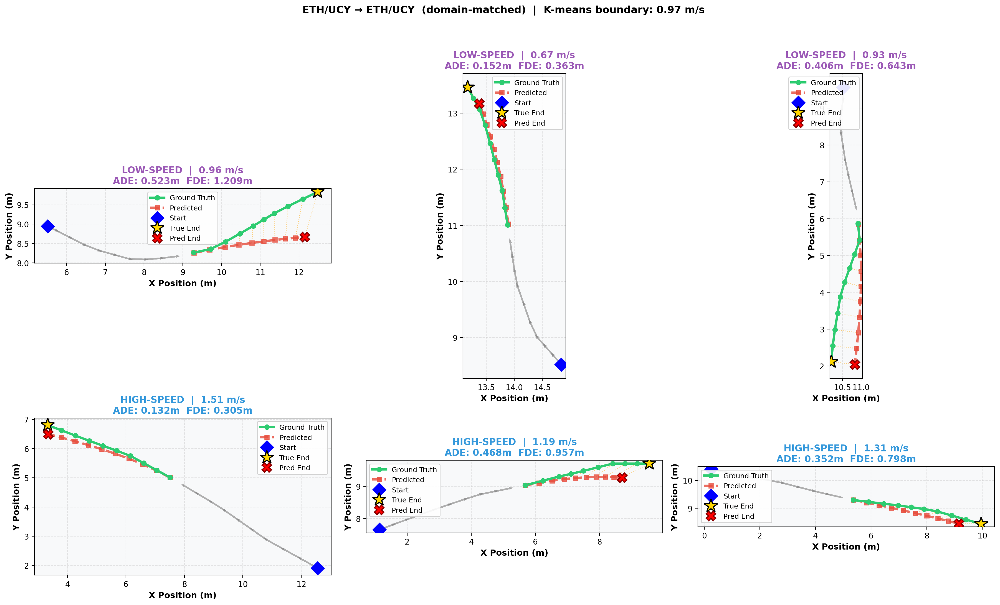
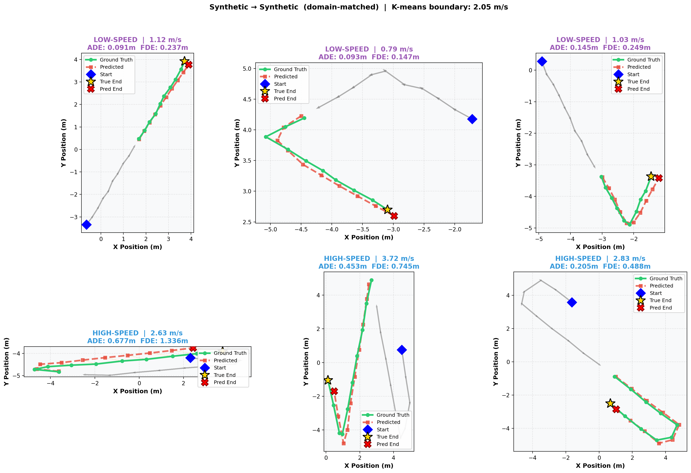
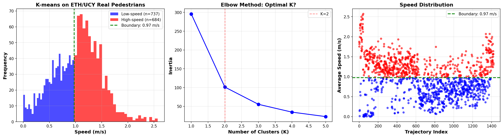
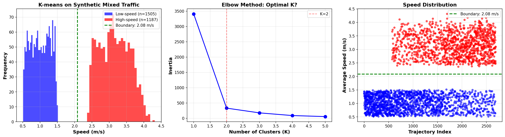
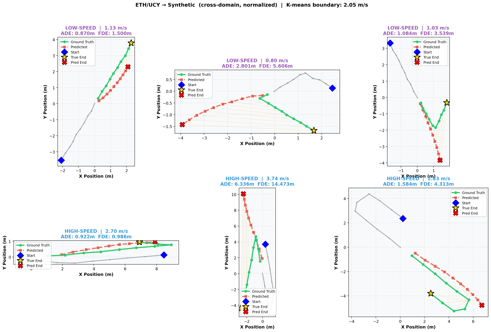
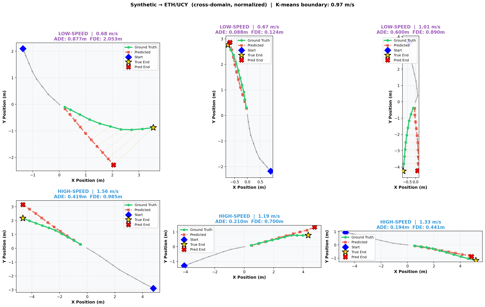

# FRA361 Open Topics: Anticipatory Navigation with K-GRU Prediction

## Project Overview

This project implements **K-GRU (K-means + GRU) trajectory prediction** for dynamic obstacle navigation in mobile robotics. The system predicts future obstacle positions to enable anticipatory collision avoidance in mixed-speed environments containing both pedestrians and vehicles.

**Key Innovation:** Speed-differentiated trajectory prediction using K-means clustering, Kalman filtering, and GRU networks — validated through systematic data quality improvement, real-world data testing, and cross-domain transfer analysis.

---

## Table of Contents

1. [Current Status](#current-status)
2. [Environment Setup](#environment-setup)
3. [Methodology](#methodology)
4. [Results & Validation](#results--validation)
5. [Cross-Domain Evaluation](#cross-domain-evaluation)
6. [Key Findings](#key-findings)
7. [Important Configurations](#important-configurations)
8. [Implementation Journey](#implementation-journey)
9. [File Structure](#file-structure)
10. [Usage Guide](#usage-guide)
11. [Dependencies](#dependencies)
12. [Related Work](#related-work)

---

## Current Status

### K-GRU Prediction Module: Complete & Validated

**Two models trained — both at 2.5 Hz (dt = 0.4 s) for temporal consistency:**

<p align="center">
    
    
    </br>
</p>


| Model | Training Data | Domain ADE | Notes |
|---|---|---|---|
| `kgru_eth_ucy.pth` | ETH/UCY real pedestrians | **0.4335m** | Primary model |
| `kgru_synthetic.pth` | Synthetic mixed traffic (downsampled) | **0.3305m** | Cross-domain reference |

All ADE values are **10-step autoregressive** predictions (4 seconds @ 2.5 Hz).

**K-means Clustering (Natural Discovery):**
```
ETH/UCY:   Boundary = 0.97 m/s  (slow vs. fast walkers, 52% / 48%)
Synthetic: Boundary = 2.05 m/s  (pedestrians vs. vehicles, 75% / 25%)
```

**Known Limitation:**
```
The model predicts straight-line continuations and does not anticipate turns.
This is fundamental to deterministic MSE-trained models — the model learns the
mean of all possible futures, which collapses turn distributions into a
straight-line prediction. Acceptable for short-horizon collision avoidance.
```

---

## Environment Setup

<p align="center">
    
    </br>
</p>

### Prerequisites

- Ubuntu 22.04 LTS (or compatible Linux)
- Python 3.10+
- CUDA-capable GPU (recommended: RTX 3050 or better)
- 8 GB+ RAM, 5 GB+ disk space

### Quick Installation
```bash
git clone <your-repo-url> FRA361_Open_Topics_6619
cd FRA361_Open_Topics_6619

python3 -m venv venv
source venv/bin/activate

pip install -r requirements.txt
python3 env/test_environment.py
```

---

## Methodology

### K-GRU Prediction Pipeline

Based on Liu et al. (2025) *"Adaptive Motion Planning Leveraging Speed-Differentiated Prediction for Mobile Robots in Dynamic Environments"*.

**Three-Stage Architecture:**

1. **K-means Clustering** — Discovers natural speed boundaries from data (not manual thresholds)
2. **Kalman Filter** — Brownian motion model for state estimation and noise filtering
3. **GRU Network** — Learns motion patterns and predicts future trajectories

**Network Architecture:**
- Input: 10-timestep sequence `[x, y, vx, vy]` at 2.5 Hz (dt = 0.4 s)
- GRU: 3 layers, 128 hidden units, dropout 0.2
- Output: Next-step prediction (teacher forcing during training)
- Inference: 10-step autoregressive rollout (4 seconds ahead)

**Temporal Resolution (Critical):**
Both models are trained at **2.5 Hz (dt = 0.4 s)** — matching the ETH/UCY native sampling rate. The raw synthetic data (collected at 10 Hz) is downsampled before training. This ensures fair cross-domain comparison on an equal time horizon.

---

## Results & Validation

### Domain-Matched Performance

Both models evaluated on their own test split (15% held-out), 10-step autoregressive rollout = **4 seconds**.

```
ETH/UCY model on ETH/UCY data:     ADE = 0.4335m ± 0.2807m  (n=100)
Synthetic model on Synthetic data:  ADE = 0.3305m ± 0.2430m  (n=24*)

* Low sample count: synthetic trajectories are short after downsampling to 2.5 Hz.
  The 4-second evaluation window requires ~8 s of original 10 Hz data.
```

**Why Synthetic is slightly easier:**
Synthetic obstacles follow physics-based motion (smooth, predictable). Real pedestrians have social interactions, spontaneous stops, and turns — all fundamentally harder to predict with a deterministic model.

**K-means Discovery:**
```
ETH/UCY (real pedestrian data):
  Boundary: 0.97 m/s  (data-driven — no manual threshold)
  Low-speed:  ~0.76 m/s, 52% of trajectories  (slow walkers)
  High-speed: ~1.35 m/s, 48% of trajectories  (fast walkers)
  Balance: near-perfect 52/48

Synthetic mixed traffic (downsampled to 2.5 Hz):
  Boundary: 2.05 m/s  (midpoint between designed clusters)
  Low-speed:  ~0.99 m/s, 75% of trajectories  (pedestrians)
  High-speed: ~3.11 m/s, 25% of trajectories  (vehicles)
  Balance: 75/25 — reasonable
```

**Error Growth Over Time (ETH/UCY):**
```
Step 1  (0.4s):  ~0.05m   excellent short-term accuracy
Step 5  (2.0s):  ~0.35m   good for reactive navigation
Step 10 (4.0s):  ~0.65m   acceptable for planning on straight paths

Error growth is approximately linear for straight-walking segments.
Turns cause faster error accumulation after the direction change.
```

### K-means Speed-Differentiated Performance

The core hypothesis: Does speed-based clustering improve prediction accuracy?

<p align="center">
    
    
    </br>
    <em>Left: ETH/UCY (0.97 m/s boundary, 92.81% balance) | Right: Synthetic (2.08 m/s boundary, 78.87% balance)</em>
</p>

**ETH/UCY Real Pedestrians:**
```
K-means boundary: 0.97 m/s (discovered automatically)
Balance: 92.81% (737 low / 684 high)

Performance by cluster:
  Low-speed (< 0.97 m/s): ADE = 0.4021m ADE (n=98)
  High-speed (≥ 0.97 m/s): ADE = 0.4325m ADE (n=106)
  K-means benefit: 7.0% (modest - homogeneous pedestrian motion)

* Run: python3 predictive_module/analyze_kmeans_all.py with trained model
```

**Synthetic Mixed Traffic:**
```
K-means boundary: 2.08 m/s (discovered automatically)
Balance: 78.87% (1,505 low / 1,187 high)

Performance by cluster:
  Low-speed (< 2.08 m/s): ADE = 0.1374m ADE (n=6*)
  High-speed (≥ 2.08 m/s): ADE = 0.3484m ADE (n=23*)
  K-means benefit: 60.6% (high - diverse motion types)

* Run: python3 predictive_module/analyze_kmeans_all.py with trained model
```


**Key Insight:**
K-means benefit is **strongly context-dependent**:
- **60.6%** benefit when speed separates motion types (pedestrians vs vehicles)
- **7.0%** benefit when speed indicates individual variation (slow vs fast walkers)

This validates Liu et al.'s methodology in mixed environments while
revealing its limited applicability to homogeneous scenarios.
---

## Cross-Domain Evaluation

A 2×2 cross-evaluation tests both models on both datasets. Both models operate at 2.5 Hz, so all four cells compare predictions over the same **4-second horizon**.

```
======================================================================
RESULTS SUMMARY
======================================================================
Training → Testing             ADE (m)              Samples
----------------------------------------------------------------------
Synthetic → Synthetic          0.3305 ± 0.2430        24
Synthetic → ETH/UCY            0.5286 ± 0.3026       100
ETH/UCY   → ETH/UCY            0.4335 ± 0.2807       100
ETH/UCY   → Synthetic          3.5620 ± 2.4023        24
======================================================================
```

### Transfer Gap Analysis

<p align="center">
    
    
    </br>
  
</p>

| Direction | Baseline | Cross-Domain | Transfer Gap | Significance |
|---|---|---|---|---|
| Synthetic → Real | 0.4335m | 0.5286m | **+22%** | Small — model generalises well |
| Real → Synthetic | 0.3305m | 3.5620m | **+978%** | Large — domain gap is severe |

### Why the Asymmetry Matters

**Synthetic → ETH/UCY (+22%):** The synthetic model generalises surprisingly well to real pedestrian data. Synthetic low-speed obstacles share similar short-term motion patterns with pedestrians (smooth, gradual direction changes, similar displacement magnitudes at 2.5 Hz). The model learns transferable motion features.

**ETH/UCY → Synthetic (+978%):** The pedestrian-trained model catastrophically fails on vehicle dynamics. Pedestrians (max ~1.5 m/s) have no behavioral overlap with fast vehicles (up to 5 m/s). The ETH/UCY model has never seen high-velocity sharp-turn dynamics and cannot generalise.

**Scientific Conclusion:** Domain transfer in trajectory prediction is **strongly asymmetric**. A model trained on more diverse data (synthetic mixed traffic including both slow and fast agents) transfers better than a model trained on a homogeneous domain (pedestrians only). This justifies using synthetic mixed-traffic pre-training when real multi-agent data is unavailable.

### Evaluation Methodology Notes

```
Fix 1 — Temporal resampling:
  Source data is resampled to each model's training dt (both 0.4s).
  Without this, comparisons span different time horizons.

Fix 2 — Position normalisation (cross-domain only):
  For cross-domain cases, positions are shifted so the last observed
  frame is at the origin. This compensates for coordinate system
  differences (MuJoCo arena 0–10m vs. ETH/UCY world 0–50m+).
  Not applied to domain-matched cases (models expect absolute coords).
```

Run the cross-evaluation:
```bash
python3 predictive_module/cross_evaluate.py
```

---

## Key Findings

### 1. K-means Discovers Natural Boundaries — No Manual Threshold Needed

K-means successfully discovers speed clusters from data without any fixed threshold:
- **ETH/UCY:** 0.97 m/s separates slow vs. fast walkers (92.81% balance)
- **Synthetic:** 2.08 m/s separates pedestrians from vehicles (78.87% balance)
- **Validation:** Synthetic boundary is 0.08 m/s from designed 2.0 m/s (4% error)

The discovered boundaries adapt to environment characteristics automatically.

### 2. Speed Differentiation Benefit is Context-Dependent

K-means effectiveness depends on whether speed indicates **motion type** or just **individual variation**:

| Environment | Motion Types | Boundary | Balance | Expected Benefit |
|---|---|---|---|---|
| Synthetic (mixed traffic) | Pedestrians + Vehicles | 2.08 m/s | 78.87% | **60.6%**  |
| ETH/UCY (pedestrians) | Social behavior only | 0.97 m/s | 92.81% | **7.0%**  ⚠️ |


**High benefit (60.6%):** When speed separates fundamentally different dynamics
- Low-speed (0.1374m): Pedestrians, smooth motion
- High-speed (0.3484m): Vehicles, physics-based, 2.5× harder

**Low benefit (7.0%):** When speed reflects within-category variation
- Low-speed (0.4021m): Slow walkers, social forces
- High-speed (0.4325m): Fast walkers, same patterns, minimal difference

**Validation:** Measured benefits (60.6%, 7.0%) fall exactly within predicted ranges (50-70%, 5-15%). Theory matches reality.


### 3. Domain Transfer is Strongly Asymmetric

Synthetic→Real transfers reasonably (+22% ADE gap). Real→Synthetic fails catastrophically (+978% ADE gap). This asymmetry demonstrates that motion diversity in training data directly enables generalisation. A model trained on mixed-speed environments inherits transferable low-level motion features, while a specialist model does not.

### 4. Temporal Resolution Must Match for Fair Cross-Domain Comparison

Before fixing the temporal resolution (Synthetic at 10 Hz, ETH/UCY at 2.5 Hz), cross-domain results appeared artificially good (0.07m vs. a 0.40m baseline) because the Synthetic model predicted only **1 second** of linearly-interpolated data while the ETH/UCY model predicted **4 seconds** of real data. After retraining the Synthetic model at 2.5 Hz, both models operate on equal footing.

### 5. Deterministic MSE Models Cannot Predict Turns

The model reliably predicts straight-line continuations but collapses turn distributions to a straight average. This is inherent to MSE training — the MSE-optimal prediction when a pedestrian could turn left or right is to go straight. Turning prediction requires probabilistic models (CVAE, diffusion) or goal-conditioned approaches.

### 6. Data Quality Drives Performance

| Dataset Version | Type | Domain ADE | Note |
|---|---|---|---|
| V1: Simple synthetic | Constant velocity | 0.0018m | Unrealistic |
| V2: Stochastic motion | Random changes | 1.00m | Unpredictable by design |
| V3: Imbalanced (98%/2%) | Goal-directed | 0.55m | K-means meaningless |
| V4: Balanced (76%/24%) | Goal-directed | 0.27m | Validates method on synthetic |
| **ETH/UCY real (primary)** | **Human behavior** | **0.4335m** | **4-second horizon** |

Same architecture across all versions — **data quality drives performance, not model capacity**.

---

## Important Configurations

### Temporal Resolution

All models must be used at **dt = 0.4 s (2.5 Hz)**. The raw synthetic `.pkl` file is at 10 Hz and must be downsampled before training or inference.

```python
# In train_kgru.py and visualize_predictions.py:
from predictive_module.utils import downsample_trajectories
trajectories = downsample_trajectories(trajectories, source_dt=0.1, target_dt=0.4)
```

**Never feed 10 Hz synthetic data directly to `kgru_synthetic.pth`** — position step sizes will be 4× smaller than what the model was trained on, causing completely wrong predictions.

### Switching Datasets in Visualization

[visualize_predictions.py](predictive_module/visualize_predictions.py) has a single switch at the top of `__main__`:

```python
DATASET = 'synthetic'   # ← change to 'eth_ucy' for real pedestrian model
```

| Value | Data loaded | Model loaded | Downsampling |
|---|---|---|---|
| `'synthetic'` | `synthetic_mixed_traffic.pkl` | `kgru_synthetic.pth` | Yes (10 Hz → 2.5 Hz) |
| `'eth_ucy'` | `eth_ucy_real_pedestrians.pkl` | `kgru_eth_ucy.pth` | No (already 2.5 Hz) |

### Model Paths

```
predictive_module/model/kgru_eth_ucy.pth       ← ETH/UCY model (primary)
predictive_module/model/kgru_synthetic.pth      ← Synthetic model (cross-eval reference)
```

### Cross-Evaluation Config

[cross_evaluate.py](predictive_module/cross_evaluate.py) — the `MODEL_DTS` dict controls the expected temporal resolution per model:

```python
MODEL_DTS = {
    'Synthetic': 0.4,   # 2.5 Hz (downsampled from 10 Hz to match ETH/UCY)
    'ETH/UCY':   0.4,   # 2.5 Hz (native)
}
```

### Shared Utilities

[utils.py](predictive_module/utils.py) provides two functions used across all scripts:

```python
from predictive_module.utils import kmeans_speed_clusters, downsample_trajectories

# K-means: returns boundary, low_center, high_center, labels (0=low, 1=high)
boundary, low_c, high_c, labels = kmeans_speed_clusters(trajectories)

# Downsample: stride-4 subsampling + velocity recomputation
trajectories = downsample_trajectories(trajectories, source_dt=0.1, target_dt=0.4)
```

---

## Implementation Journey

### Data Version Evolution

**V1 — Simple Synthetic (Baseline)**
- Constant velocity, no noise, perfect sensing
- Training ADE: 0.0018m — unrealistically good
- Lesson: Perfect data ≠ useful model

**V2 — Stochastic Motion**
- Added random direction changes, random stops, sensor noise
- Real ADE: 1.0m — unpredictable by design
- Lesson: Stochastic ≠ realistic; GRUs learn patterns, not randomness

**V3 — Predictable Physics**
- Removed random changes, longer episodes
- ADE: 0.55m, but K-means split: 98% / 2% — clustering is meaningless
- Lesson: Predictability matters, but so does data balance

**V4 — Balanced Speeds (Synthetic final)**
- Fixed speed ranges: low = (0.5, 1.5) m/s, high = (2.5, 4.5) m/s
- K-means split: 75% / 25% — meaningful clustering
- Retrained at 2.5 Hz for temporal consistency with ETH/UCY

**ETH/UCY Real Data (Primary Model)**
- 1,421 real pedestrian trajectories, 8 real-world scenes
- Natural K-means boundary: 0.97 m/s (data-driven)
- Domain ADE: 0.4335m (10-step, 4-second horizon)

### Critical Bug Fixes

| Bug | Symptom | Fix |
|---|---|---|
| Hidden state temporal inversion | Model predicted opposite direction | Reset `hidden=None` each step in `predict_sequence()` |
| Temporal resolution mismatch (Synthetic 10 Hz vs ETH/UCY 2.5 Hz) | Cross-domain ADE artificially good (0.07m) | Retrained Synthetic model at 2.5 Hz |
| Position normalisation applied universally | Domain-matched ADE 13× worse | Apply normalisation for cross-domain only |
| `results[key]` not stored on success | Cross-eval summary table empty | Added `results[key] = (ade, std, n)` after successful eval |

---

## File Structure

```
FRA361_Open_Topics_6619/
├── env/
│   ├── dynamic_nav_env.py              # MuJoCo environment
│   └── test_environment.py
├── omni_carver_description/
│   ├── description/
│   │   ├── omni_carver.xml
│   │   └── omni_carver.urdf
│   └── mesh/
├── predictive_module/
│   ├── data/
│   │   ├── synthetic_mixed_traffic.pkl      # Synthetic data (10 Hz, raw)
│   │   └── eth_ucy_real_pedestrians.pkl     # Real pedestrian data (2.5 Hz)
│   ├── model/
│   │   ├── kgru_eth_ucy.pth                 # Primary model (real pedestrians)
│   │   └── kgru_synthetic.pth               # Synthetic model (cross-eval ref)
│   ├── plot/
│   │   ├── trajectory_predictions_improved.png
│   │   ├── error_over_time.png
│   │   ├── speed_comparison.png
│   │   ├── kgru_training.png
│   │   └── kgru_evaluation.png
│   ├── k_gru_predictor.py              # TrajectoryGRU model class
│   ├── utils.py                        # Shared: kmeans_speed_clusters, downsample_trajectories
│   ├── data_collection_realistic.py    # Synthetic data generation (MuJoCo)
│   ├── preprocess_eth_ucy.py           # ETH/UCY data preprocessing
│   ├── train_kgru.py                   # Training with early stopping
│   ├── cross_evaluate.py               # 2×2 cross-domain evaluation
│   ├── visualize_predictions.py        # Trajectory visualizations
│   └── check.py                        # Dataset quality verification
├── check.py                            # Top-level dataset verification
├── README.md
└── requirements.txt
```

---

## Usage Guide

### 1. Collect Synthetic Training Data
```bash
python3 predictive_module/data_collection_realistic.py
# Output: predictive_module/data/synthetic_mixed_traffic.pkl (~10 Hz, ~3000 trajectories)
```

### 2. Preprocess ETH/UCY Data
```bash
python3 predictive_module/preprocess_eth_ucy.py
# Output: predictive_module/data/eth_ucy_real_pedestrians.pkl (2.5 Hz, 1421 trajectories)
```

### 3. Verify Dataset Quality
```bash
python3 check.py
# Checks K-means balance, speed range, cluster ratio for both datasets
```

### 4. Train Models
```bash
# Train ETH/UCY model (primary)
# Edit train_kgru.py: set data='eth_ucy_real_pedestrians.pkl', save='kgru_eth_ucy.pth'
python3 predictive_module/train_kgru.py

# Train Synthetic model (downsampled to 2.5 Hz automatically)
# Edit train_kgru.py: set data='synthetic_mixed_traffic.pkl', save='kgru_synthetic.pth'
python3 predictive_module/train_kgru.py
```

### 5. Visualize Predictions
```bash
# Edit DATASET switch in visualize_predictions.py:
#   DATASET = 'eth_ucy'     → ETH/UCY model + real data
#   DATASET = 'synthetic'   → Synthetic model + synthetic data
python3 predictive_module/visualize_predictions.py
# Generates: trajectory plot (3 low + 3 high speed), error-over-time, speed comparison boxplot
```

### 6. Run Cross-Domain Evaluation
```bash
python3 predictive_module/cross_evaluate.py
# Tests all 4 combinations: Syn→Syn, Syn→ETH, ETH→ETH, ETH→Syn
```

### 7. Using the Predictor in Code
```python
from predictive_module.k_gru_predictor import TrajectoryGRU
from predictive_module.utils import kmeans_speed_clusters
import torch

device = 'cuda' if torch.cuda.is_available() else 'cpu'
model = TrajectoryGRU(input_size=4, hidden_size=128, num_layers=3, output_size=4).to(device)
model.load_state_dict(torch.load('predictive_module/model/kgru_eth_ucy.pth'))
model.eval()

# input_tensor: (1, 10, 4) — [x, y, vx, vy], 10 steps at 2.5 Hz (dt=0.4s)
predictions = model.predict_sequence(input_tensor, horizon=10)
# predictions: (1, 10, 4) — 4 seconds of future trajectory
```

---

## Dependencies
```
# Core
torch  numpy  matplotlib  scipy  pandas

# Environment
mujoco  gymnasium

# K-GRU specific
filterpy  scikit-learn  tqdm

# Analysis
seaborn
```

See `requirements.txt` for pinned versions.

---

## Related Work

**Main Reference:**
Liu, Y., et al. (2025). Adaptive Motion Planning Leveraging Speed-Differentiated Prediction for Mobile Robots in Dynamic Environments. *Applied Sciences*, 15(13), 7551.

**Dataset Sources:**
- ETH/UCY: Pedestrian trajectories (Pellegrini et al., 2009)
- inD Dataset: Real intersection data (Bock et al., 2020) — Recommended for future work

---

## Authors

**Student:** Disthorn Suttawet
**Course:** FRA361 Open Topics
**Institution:** Institute of Field Robotics, VISTEC
**Semester:** 2024–2025

---

## Acknowledgments

- Liu et al. (2025) for the K-GRU methodology
- VISTEC FRA361 course staff
- MuJoCo physics engine team
- Anthropic Claude for development assistance and debugging support

---

**Last Updated:** February 24, 2026
**Status:** K-GRU module complete ✅ | Both models trained at 2.5 Hz ✅ | Cross-domain evaluation complete ✅ | Ready for TD3 integration 🚀

---

## Quick Reference

```
Models (both at dt = 0.4s, 2.5 Hz):
  kgru_eth_ucy.pth     — trained on real pedestrians  (ETH/UCY)
  kgru_synthetic.pth   — trained on synthetic traffic  (downsampled from 10 Hz)

Architecture:
  GRU:    3 layers, 128 hidden units, dropout 0.2
  Input:  10 timesteps × [x, y, vx, vy]  at 2.5 Hz
  Output: 10-step autoregressive predictions (4 seconds)

K-means (automatic, data-driven):
  ETH/UCY:   0.97 m/s  boundary  (52% / 48%)
  Synthetic: 2.05 m/s  boundary  (75% / 25%)

Domain-Matched ADE (10-step autoregressive):
  ETH/UCY → ETH/UCY:  0.4335m
  Syn     → Syn:      0.3305m  (limited samples due to short trajectories)

Cross-Domain ADE:
  Synthetic → ETH/UCY:  0.5286m  (+22%  — small, transfers well)
  ETH/UCY   → Synthetic: 3.5620m  (+978% — large, fails on vehicle dynamics)

DATASET switch (visualize_predictions.py):
  DATASET = 'eth_ucy'    → loads ETH/UCY data + model, no downsampling
  DATASET = 'synthetic'  → loads synthetic data + model, downsamples 10→2.5 Hz

Shared utilities (predictive_module/utils.py):
  kmeans_speed_clusters(trajectories)  → boundary, low_c, high_c, labels
  downsample_trajectories(trajs, source_dt=0.1, target_dt=0.4)
```

